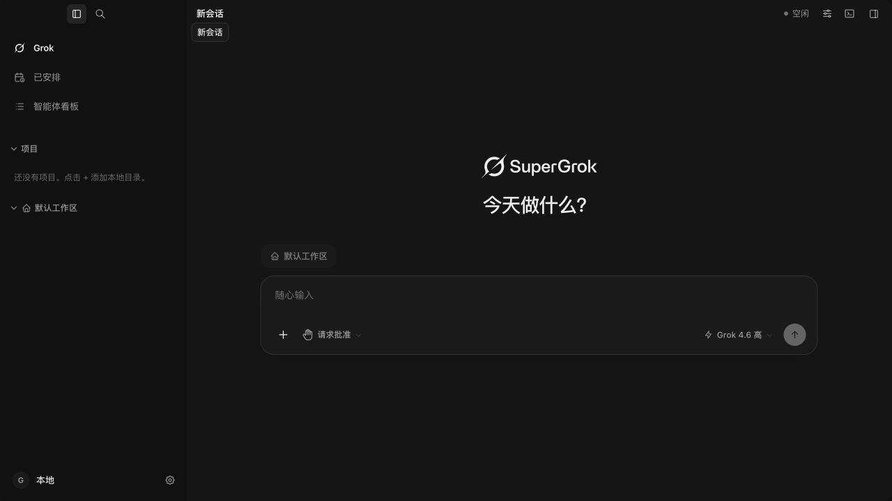
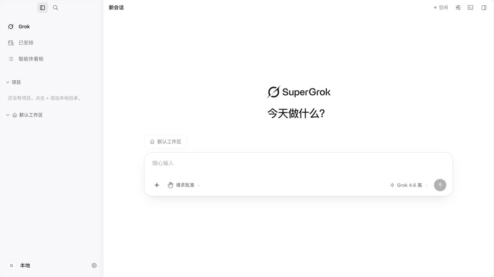
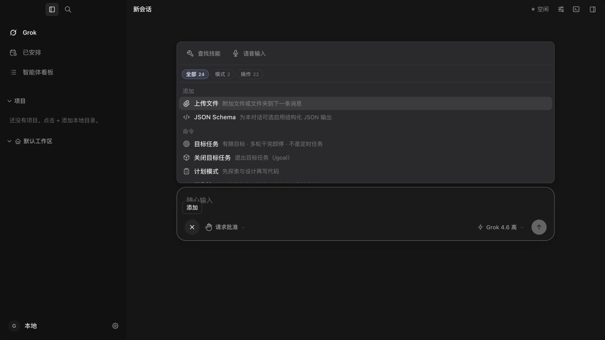

# 输入框工具栏整理 · 2026-09-16

## 使用方式

- 桌面模型／推理强度选择移入输入框右下角，位于发送按钮左侧。工作区选择仍在输入框上方。
- 语音输入和查找技能收进「＋」菜单顶部，默认不再各占一个工具栏图标。无需新增设置开关。
- 「＋ → 查找技能」打开原有技能面板；菜单内仍可选择已安装、已启用的技能。没有技能时仍提示去「扩展 → 插件市场」安装，或去「扩展 → 技能」启用。
- 「＋ → 语音输入」沿用现有登录／STT 配置检查；未配置时提示设置路径。申请麦克风、录音、转写期间，输入框内显示停止／取消按钮。原有语音快捷键保留，Live Voice 占用时禁止启动新的听写。
- 模型菜单在输入框内使用可收缩布局，长名称可以截断；展开时不再把父容器撑宽到 280px。模型、推理强度、上下文窗口子菜单继续沿用原有浮层。
- 手机仍使用原有工具面板和语音入口。本轮没有修改识别服务、网络、鉴权或权限策略。

## 验证

- `pnpm build:ui`（TypeScript + Vite）、`pnpm lint`、`git diff --check` 通过。仍有既有大分块提示。
- 六个相关测试文件共 109 项通过，覆盖模型菜单 portal、紧凑模式不撑宽父容器、工具入口点击、语音活动阶段的停止／取消入口、Live Voice 互斥、布局约束及既有语音／斜杠行为。
- 将新语音菜单入口测试加强为 Tab + Space 激活后，输入框控件六项测试再次通过。

```sh
pnpm exec vitest run src/app/WorkbenchComposerShell.controls.test.tsx src/components/ComposerPortalPop.test.tsx src/lib/composerColumn.guard.test.ts src/lib/composerChatWidth.guard.test.ts src/lib/voiceDictation.test.ts src/lib/slashCatalog.test.ts
```

- 隔离 Vite 应用实测 1280×720 深浅色主页、添加菜单、技能面板打开与收起、未配置语音的提示，以及 720×500 模型主菜单和模型子菜单。发送按钮保持在输入框内，菜单有背景且未被裁切。
- 测试未使用真实麦克风或模型服务；录音状态用组件测试验证。未重新制作安装包，也未替换正在运行的安装版。
- App/AppWorkbench 未改，总计仍为 13,472 行。

## 预览







## 回滚

本轮提交可单独回滚：

```sh
git revert $(git log -1 --format=%H --grep='feat(composer): move model picker inside and tuck tools into add menu')
```

本轮前基线为 `df3573af`；回滚后重新执行上述测试与构建。
