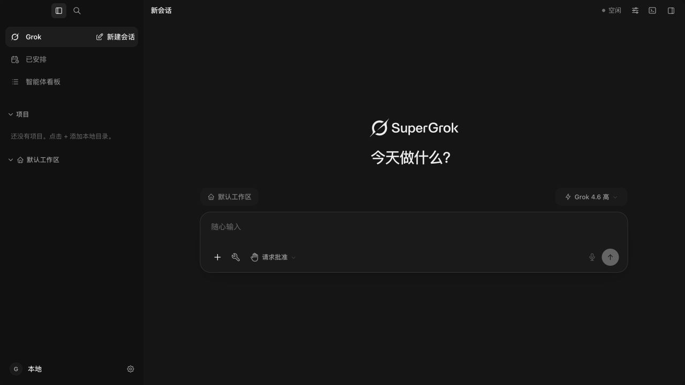
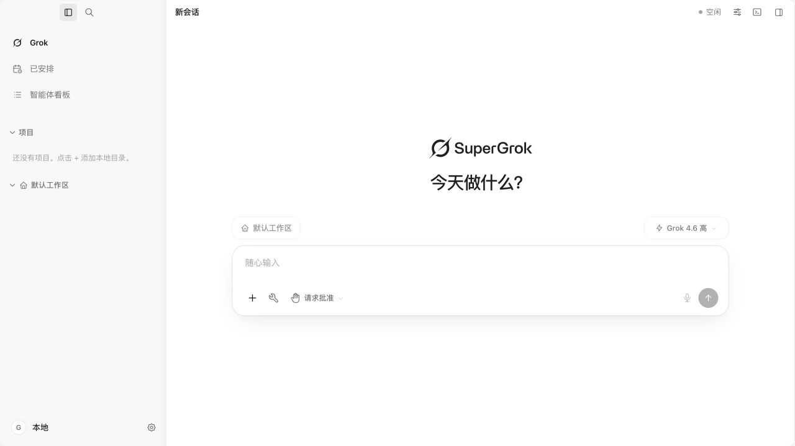
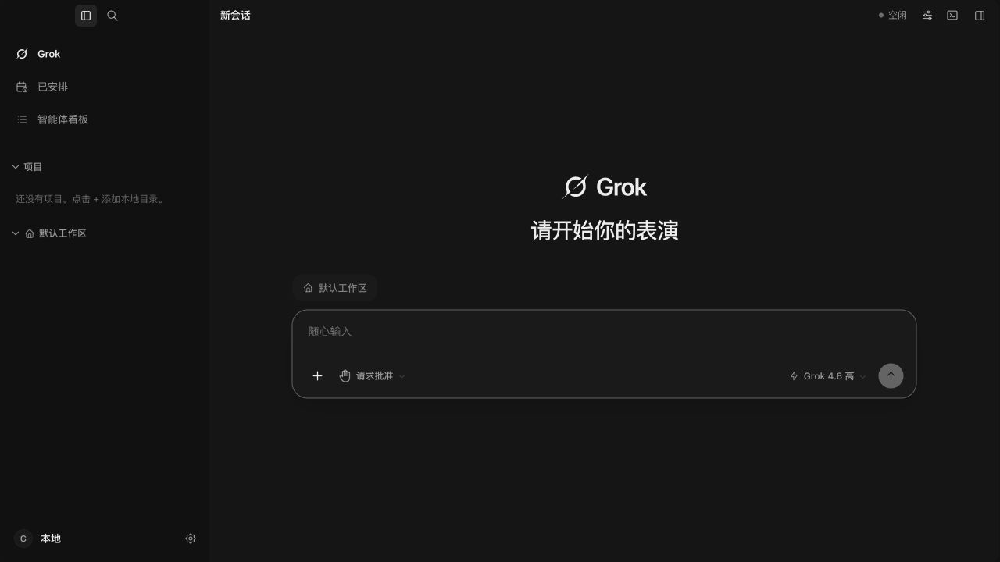

# 主页面视觉调整 · 2026-09-16

## 效果与范围

参考 Codex 的克制布局调整现有主页面，不引入新皮肤或设置。

- 新会话的欢迎语与输入框组成居中区域，减少二者之间的空白；窗口高度不超过 600px 时收起品牌标识，为长输入保留空间。
- 输入框采用 20px 圆角、更充足的内边距、轻阴影和中性的焦点边框。工作区与模型选择条降低边框存在感，与输入框拉开间距。
- 侧栏导航增加行间留白，项目分组提高可读性，当前会话略加字重；顶栏与账号区减少横向分割线。
- 沿用已有主题颜色、壁纸透明度、聊天宽度和输入行数设置。未改会话逻辑、正文渲染、虚拟列表行高或窗口控制区域，未增加模糊层和动画。

## 验证

- `pnpm build:ui`：TypeScript 与 Vite 构建通过；仍有既有大分块提示。
- `pnpm lint`、`git diff --check`：通过。
- 下列既有测试共 8 文件、63 项通过：

```sh
pnpm exec vitest run src/components/ComposerEditor.layout.test.tsx src/components/ComposerPortalPop.test.tsx src/lib/composerChatWidth.guard.test.ts src/lib/composerEndPad.test.ts src/lib/composerMinRows.test.ts src/lib/sidebarDensity.test.ts src/lib/layout.test.ts src/styles/skins.streamPerf.test.ts
```

- 实际应用通过隔离的 Vite 浏览器入口检查：1280×720 深/浅色新会话，820×620 多行输入，720×500 十二行输入；模型菜单、添加菜单以及清空草稿确认框正常显示，发送与权限按钮保持可见。测试草稿已清理，视口已恢复。
- 浏览器没有 Tauri 后端：此次视觉验收未调用真实模型，未验证安装包内的真实对话回合；自定义壁纸和手机端未逐一实测。相关配色、透明度和手机底部布局规则仍沿用现有实现。
- `App.tsx` 与 `AppWorkbench.tsx` 未修改，总计 13,472 行。
- 尚未制作新安装包，运行中的 `/Applications/Grok.app` 未替换。

## 实际预览

深色：



浅色：



## 回滚

在当前修改基线 `9051e234` 上，可恢复本轮样式，保留验收记录：

```sh
git restore --source=9051e234 -- src/styles/chat.part1.css src/styles/chat.part2.css src/styles/settings.part5.css src/styles/sidebar.part1b.css src/styles/sidebar.part2.css src/styles/sidebar.part4.css
```

随后重新执行构建验证，并在 `progress.md` 追加回滚记录。


## 欢迎区文案更新（2026-09-16）

主页面原 SuperGrok 品牌展示改为 Grok，复用现有 Grok 图标；简体中文欢迎语改为「请开始你的表演」。十五种语言的欢迎语和欢迎动画设置说明同步更新；已有服务商专用标识和账户订阅信息沿用原有展示。

已通过 TypeScript + Vite 构建、改动文件 ESLint、多语言与欢迎动画 44 项测试、git diff --check。隔离浏览器确认品牌与欢迎语显示正确。欢迎动画测试中的旧布局断言同步为前两轮已实施的居中布局和间距；本轮未改变动画行为。新文案仍需重新打包安装才能出现在安装版。



本轮回滚：`git revert $(git log -1 --format=%H --grep='style(welcome): use Grok branding and refresh greeting')`；本轮前基线 c96e37da。
